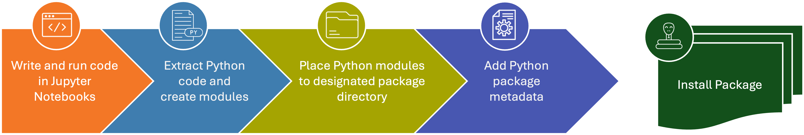

# Packaging notebook introduction and demo

This notebook demonstrates how powerful packaging your Python code
can be ... even for yourself.

Before we get ahead of ourselves. Let's think about the **WHY**.
You might ask yourself:

- why would I want to package my code?
- can't I just pass around notebooks?
- what's the point of all this?
- what is the meaning of life?

... well, maybe not the last one. But the others are valid questions.

## What is a Python package?

A "package" or officially called a "distribution package" is a
piece of software that can be installed and distributed
for use by others. That's it. It's like installing an app on your phone.

Okay, great, but I've also heard the term "library" or "module", how do they relate?

### Module

A single file of Python code that can be imported into Python
scripts or other modules, also known officially as an "import package". This is the smallest unit of code reuse in Python.
You'll see these as `.py` files.

As example, you can create a `hello_world` module by:

1. Create a file called `hello_world.py` with the following content:

    ```python
    def say_hello():
        print("Hello, World!")
    ```

2. Then, you can import this module in another Python script or notebook:

    ```python
    from hello_world import say_hello

    say_hello()
    ```

    This will print `Hello, World!` to the console.

This is a simple example of a module, but you can have more complex modules with many functions and classes.

### Library

This is an umbrella term that loosely means a "bundle of code".
Often times this term is used interchangeably with "package".
As it can be a collection of modules and packages that provide specific functionality or a set of related functionalities. For example, [Matplotlib](https://matplotlib.org/) is a plotting library that contains many modules to help you plot data or [Xarray](http://xarray.pydata.org/en/stable/) is a library that includes several modules and packages to help you work with labeled multi-dimensional arrays.

### The Python Terms Hierarchy

Here's a hierarchy of Python terms from smallest to largest to help you understand the relationship between modules, packages, and libraries:


## Why package your code?

At this point, you now what it means for a collection of code to be a package.
But there's still the question of why you would want to package your code?

Here are some reasons:

- **Reusability**: you can reuse your code in other projects without having to copy and paste it.
- **Maintainability**: you can maintain your code in a single place and update it without having to update it in multiple places.
- **Collaboration**: you can share your code with others and they can use it without having to understand the internals.
- **Distribution**: you can distribute your code to others and they can install it like any other package.

## The workflow

At this point, hopefully you're convinced that packaging your code is a good idea.
But how do you do it? There are many ways to package your code,
but we'll focus on a simple way to package your code with a best practice workflow recommended by the [Python Packaging Authority (PyPA)](https://www.pypa.io/en/latest/), a working group that maintains a core set of software projects used in Python packaging.

PyPA have a guide called the [Python Packaging User Guide](https://packaging.python.org/),
which is the authoritative resource on how to package, publish, and install Python projects using current tools.
We will follow the guide to package our code, but we'll simplify it a bit to make it easier to understand and more practical for our scientific software development workflow.

Here's an overview of what a full workflow from notebooks to a package looks like:



With this workflow, let's package a sample python code that we have in the [`sample.ipynb`](./sample.ipynb) notebook into a package called `eggsample`.

The goal is that once this code is packaged,
we can install it, then, from a command line,
we can run the code with a command `eggsample` and it will output on the terminal console, the same output as running the code in the notebook.
Simple enough? Well, let's get started!

## Demo

TODO: Add demo here
